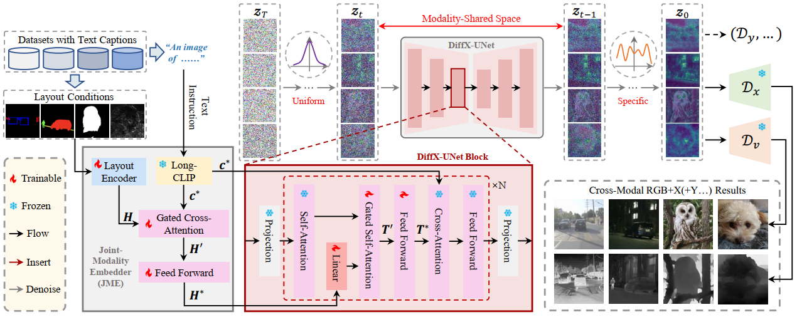
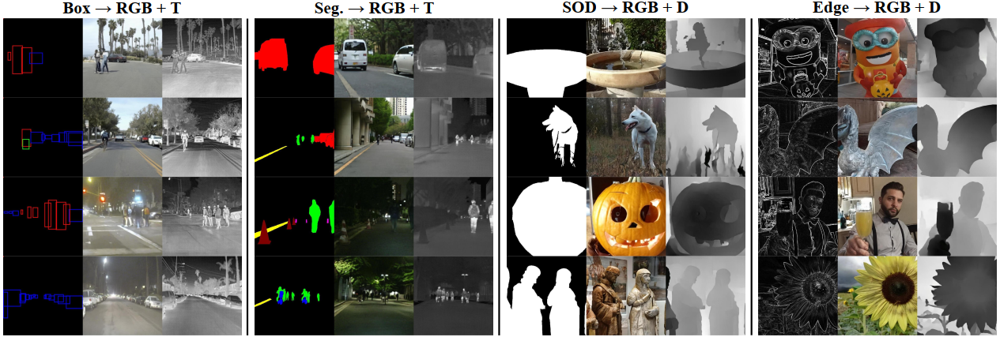
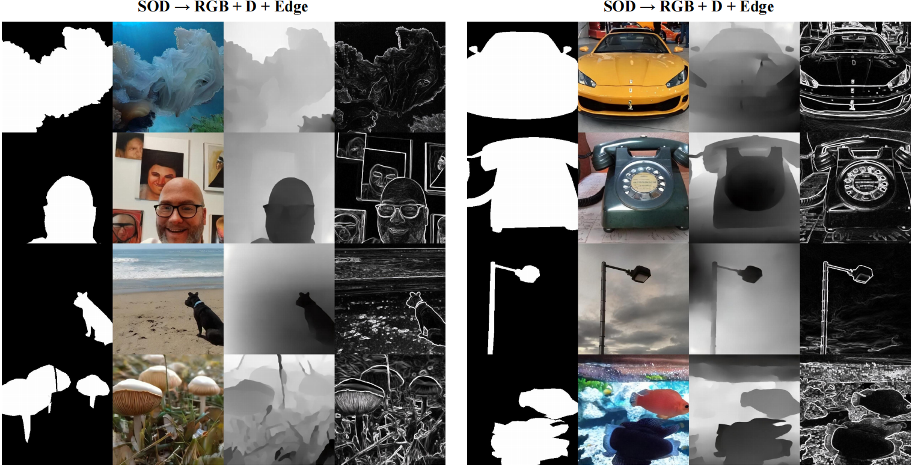

# DiffX: Guide Your Layout to Cross-Modal Generative Modeling

> **TITLE: DiffX: Guide Your Layout to Cross-Modal Generative Modeling** [[Paper](https://arxiv.org/abs/2407.15488)]
>
> **AUTHORS:** Zeyu Wang*, Jingyu Lin*, Yifei Qian, Yi Huang, Shicen Tian, Bosong Chai, Juncan Deng, Qu Yang, Lan Du, Cunjian Chen, Yufei Guo, Kejie Huang (*These authors contributed equally; †Corresponding authors).
> 

>**ABSTRACT**:
> Diffusion models have made significant strides in languagedriven and layout-driven image generation. However, most diffusion models are limited to visible RGB image generation. In fact, human perception of the world is enriched by diverse viewpoints, such as chromatic contrast, thermal illumination, and depth information. In this paper, we introduce a novel diffusion model for general layoutguided cross-modal generation, called DiffX. Notably, our DiffX presents a simple yet effective cross-modal generative modeling pipeline, which conducts diffusion and denoising processes in the modality shared latent space. Moreover, we introduce the Joint-Modality Embedder (JME) to enhance the interaction between layout and text conditions by incorporating a gated attention mechanism. To facilitate the user-instructed training, we construct the cross-modal image datasets with detailed text captions by the LargeMultimodal Model (LMM) and our human-in-the-loop refinement. Through extensive experiments, our DiffX demonstrates robustness in cross-modal “RGB+X” image generation on FLIR, MFNet, and COME15K datasets, guided by various layout conditions. It also shows the potential for the adaptive generation of “RGB+X+Y(+Z)” images or more diverse modalities on COME15K and MCXFace datasets. Our code and constructed cross-modal image datasets are available at https://github.com/zeyuwang-zju/DiffX.  



## Updates

**[15/09/2024]** Code released!

## TODO
- [x] Release code!
- [ ] Complete the usage instruction
- [ ] Release text captions in datasets
- [ ] Release pre-trained model weights

## Setup
To set up our environment, please run:
```
pip install -r requirements.txt
```
## Usage
**1. Dataset Preparation**...

**2. Training:**

   For the four types of ''RGB+X'' generation tasks on FLIR, MFNet, and COME15K datasets:
   ```
   # Firstly, train the MP-VAE:
   CUDA_VISIBLE_DEVICES=0,1,2,3 python -m torch.distributed.launch --nproc_per_node=4 scripts/train_autoencoder.py  --yaml_file=configs/flir_text.yaml  --DATA_ROOT=./DATA/flir/   --batch_size=2   --save_every_iters 1000   --name flir
   CUDA_VISIBLE_DEVICES=0,1,2,3 python -m torch.distributed.launch --nproc_per_node=4 scripts/train_autoencoder.py  --yaml_file=configs/mfnet.yaml  --DATA_ROOT=./DATA/mfnet/   --batch_size=2   --save_every_iters 1000   --name mfnet
   CUDA_VISIBLE_DEVICES=0,1,2,3 python -m torch.distributed.launch --nproc_per_node=4 scripts/train_autoencoder.py  --yaml_file=configs/come.yaml  --DATA_ROOT=./DATA/come/   --batch_size=2   --save_every_iters 1000   --name come
   CUDA_VISIBLE_DEVICES=0,1,2,3 python -m torch.distributed.launch --nproc_per_node=4 scripts/train_autoencoder.py  --yaml_file=configs/come_sobel.yaml  --DATA_ROOT=./DATA/come/   --batch_size=2   --save_every_iters 1000   --name come_sobel

   # Secondly, train the DiffX-UNet:
   CUDA_VISIBLE_DEVICES=0,1,2,3 python -m torch.distributed.launch --nproc_per_node=4 scripts/train_diffusion.py  --yaml_file=configs/flir_text.yaml  --DATA_ROOT=./DATA/flir/   --batch_size=8   --save_every_iters 1000   --name flir
   CUDA_VISIBLE_DEVICES=0,1,2,3 python -m torch.distributed.launch --nproc_per_node=4 scripts/train_diffusion.py  --yaml_file=configs/mfnet.yaml  --DATA_ROOT=./DATA/mfnet/   --batch_size=8   --save_every_iters 1000   --name mfnet
   CUDA_VISIBLE_DEVICES=0,1,2,3 python -m torch.distributed.launch --nproc_per_node=4 scripts/train_diffusion.py  --yaml_file=configs/come.yaml  --DATA_ROOT=./DATA/come/   --batch_size=8   --save_every_iters 1000   --name come
   CUDA_VISIBLE_DEVICES=0,1,2,3 python -m torch.distributed.launch --nproc_per_node=4 scripts/train_diffusion.py  --yaml_file=configs/come_sobel.yaml  --DATA_ROOT=./DATA/come/   --batch_size=8   --save_every_iters 1000   --name come_sobel
   ```

   For the ''SOD → RGB+D+Edge'' task on COME15K dataset:
   ```
   # Firstly, train the MP-VAE:
   CUDA_VISIBLE_DEVICES=0,1,2,3 python -m torch.distributed.launch --nproc_per_node=4 scripts/train_autoencoder3.py  --yaml_file=configs/come_sobel_sod.yaml  --DATA_ROOT=./DATA/come/   --batch_size=1   --save_every_iters 1000   --name come3
   # Secondly, train the DiffX-UNet:
   CUDA_VISIBLE_DEVICES=0,1,2,3 python -m torch.distributed.launch --nproc_per_node=4 scripts/train_diffusion3.py  --yaml_file=configs/come_sobel_sod.yaml  --DATA_ROOT=./DATA/come/   --batch_size=8   --save_every_iters 1000   --name come3
   ```

   For the ''3DDFA → RGB+NIR+SWIR+T'' task on MCXFace dataset:
   ```
   # Firstly, train the MP-VAE:
   CUDA_VISIBLE_DEVICES=0,1,2,3 python -m torch.distributed.launch --nproc_per_node=4 scripts/train_autoencoder4.py  --yaml_file=configs/mcxface.yaml  --DATA_ROOT=./DATA/mcxface/   --batch_size=1   --save_every_iters 1000   --name mcxface
   # Secondly, train the DiffX-UNet:
   CUDA_VISIBLE_DEVICES=0,1,2,3 python -m torch.distributed.launch --nproc_per_node=4 scripts/train_diffusion4.py  --yaml_file=configs/mcxface.yaml  --DATA_ROOT=./DATA/mcxface/   --batch_size=2   --save_every_iters 1000   --name mcxface
   ```

**3. Inference:**

   For the four types of ''RGB+X'' generation tasks on FLIR, MFNet, and COME15K datasets:
   ```
   CUDA_VISIBLE_DEVICES=0 python -m torch.distributed.launch --nproc_per_node=1 inference.py  --yaml_file=configs/flir_text.yaml  --DATA_ROOT=./DATA/flir/  --name flir
   CUDA_VISIBLE_DEVICES=0 python -m torch.distributed.launch --nproc_per_node=1 inference.py  --yaml_file=configs/mfnet.yaml  --DATA_ROOT=./DATA/flir/  --name mfnet
   CUDA_VISIBLE_DEVICES=0 python -m torch.distributed.launch --nproc_per_node=1 inference.py  --yaml_file=configs/come.yaml  --DATA_ROOT=./DATA/flir/  --name come
   CUDA_VISIBLE_DEVICES=0 python -m torch.distributed.launch --nproc_per_node=1 inference.py  --yaml_file=configs/come_sobel.yaml  --DATA_ROOT=./DATA/flir/  --name come_sobel
   ```

   For the ''SOD → RGB+D+Edge'' task on COME15K dataset:
   ```
   CUDA_VISIBLE_DEVICES=0 python -m torch.distributed.launch --nproc_per_node=1 scripts/inference3.py  --yaml_file=configs/come_sobel_sod.yaml  --DATA_ROOT=./DATA/come/  --name come3
   ```

   For the ''3DDFA → RGB+NIR+SWIR+T'' task on MCXFace dataset:
   ```
   CUDA_VISIBLE_DEVICES=0 python -m torch.distributed.launch --nproc_per_node=1 scripts/inference4.py  --yaml_file=configs/mcxface.yaml  --DATA_ROOT=./DATA/mcxface/  --batch_size=1  --name mcxface
   ```

## Pretrained Models
Pretained models coming soon.

## Acknowledgements
This code is built on [GLIGEN (PyTorch)](https://github.com/gligen/GLIGEN) and [Long-CLIP (PyTorch)](https://github.com/beichenzbc/Long-CLIP). We thank the authors for sharing the codes.

## Licencing

Copyright (C) 2024 Zeyu Wang

This program is free software: you can redistribute it and/or modify it under the terms of the GNU General Public License as published by the Free Software Foundation, version 3 of the License.

## Contact
If you have any questions, please contact me by email (wangzeyu2020@zju.edu.cn).

## Citation
If you make use of our work, please cite our paper:
```
@misc{wang2024diffxguidelayoutcrossmodal,
      title={DiffX: Guide Your Layout to Cross-Modal Generative Modeling}, 
      author={Zeyu Wang and Jingyu Lin and Yifei Qian and Yi Huang and Shicen Tian and Bosong Chai and Juncan Deng and Qu Yang and Lan Du and Cunjian Chen and Yufei Guo and Kejie Huang},
      year={2024},
      eprint={2407.15488},
      archivePrefix={arXiv},
      primaryClass={cs.CV},
      url={https://arxiv.org/abs/2407.15488}, 
}
```

## Results
**Results1:** Qualitative results of cross-modal “RGB+X” generation on FLIR, MFNet, and COME15K datasets:




**Results2:** Qualitative results on “SOD → RGB+D+Edge” task on COME15K dataset:




**Results3:** Qualitative results on “3DDFA → RGB+NIR+SWIR+T” task on MCXFace dataset  :


